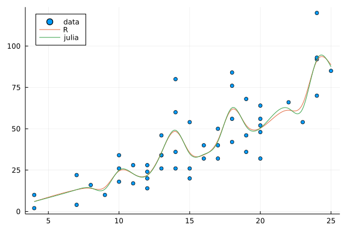

SmoothSpline
============

[](https://github.com/robertdj/SmoothSpline.jl/actions)
[](https://codecov.io/github/robertdj/SmoothSpline.jl?branch=master)

The *SmoothSpline* package is a port of R's `smooth.spline` function for regression with cubic B-splines.
My original goal was to get "exactly" the same results as `smooth.spline`.

There is already a similar package for this kind of regression, namely the [SmoothingSplines package](https://github.com/nignatiadis/SmoothingSplines.jl).
But *SmoothingSplines* aim to "provide the same functionality as R's `smooth.spline` function", but "the implementation however is completely independent of the R function".

Along the way I discovered discrepancies between the R/Fortran *implementation* and the math. 
I implement the math correctly, but also *test* against the R/Fortran implementation.
All the bloody details are in `doc/splines.pdf`.

The *SmoothSpline* package is currently quite self-contained, because a sub-goal was to get a better understanding of how spline regression works.
For example, I provide all functionality for working with B-splines instead of relying on other packages to do this.


# Installation

SmoothSpline is not registered as an official package.


# Usage

As an example, we make a regression with the classic `mtcars` dataset from R and compare 

```julia
import LinearAlgebra
using Mocking
using Plots
using RCall
using SmoothSpline
```


First we perform the regression in R using the [RCall package](https://github.com/JuliaInterop/RCall.jl).
The `spar` parameter should be in the interval `(0, 1]` and controls the sensitivity to outliers.
Here we use a value that demonstrates the differences between the R and Julia implementations.

```julia
spar = 0.2
spline_model_r = RCall.rcopy(R"spline_model <- smooth.spline(cars[['speed']], cars[['dist']], spar = $spar)");
```


We can make predictions with this model to compare with the predictions from *SmoothSpline*.

```julia
obs_x = spline_model_r[:data][:x]
obs_y = spline_model_r[:data][:y]
x = range(extrema(obs_x)...; length = 200)
predictions_r = RCall.rcopy(R"predict(spline_model, $x)");
```


In Julia using SmoothSpline with the same data

```julia
spline_model = SmoothSpline.smooth_spline(obs_x, obs_y, spar)
predictions_julia = SmoothSpline.predict(spline_model, x);
```


There is a small difference between the two sets of predictions:

```julia
maximum(abs, predictions_r[:y] - predictions_julia)
```

```
0.005927871894229497
```


But visually they are identical:

```julia
scatter(obs_x, obs_y, label = "data", legend = :topleft)
plot!(predictions_r[:x], predictions_r[:y], label = "R")
plot!(x, predictions_julia, label = "julia")
```


## Discrepancies

With the [Mocking package](https://github.com/invenia/Mocking.jl) we can emulate `smooth.spline`'s behavior with *SmoothSpline*.
The reason for these mocks are explained in `doc/splines.pdf`, so I wont comment further on the motivation here.

```julia
Mocking.activate()

patch1 = @patch SmoothSpline.OneThird() = 0.333
spline_model_like_R = apply(patch1) do
    SmoothSpline.smooth_spline(obs_x, obs_y, spar)
end

patch2 = @patch SmoothSpline.tr(A, lead, lag) = LinearAlgebra.tr(A)
spline_model_tr = apply(patch2) do
    SmoothSpline.smooth_spline(obs_x, obs_y, spar)
end

predictions_julia_like_R = SmoothSpline.predict(spline_model_like_R, x);
```


One of the models is "exactly" like R's:

```julia
maximum(abs, predictions_r[:y] - predictions_julia_like_R)
```

```
4.263256414560601e-14
```


The other is so different that we can visualize it

```julia
scatter(obs_x, obs_y, label = "data", legend = :topleft)
plot!(x, predictions_julia_like_R, label = "R")
plot!(x, SmoothSpline.predict(spline_model_tr, x), label = "julia")
```




# License

I have been scrutinizing the source code of R's `smooth.spline`.
R is licensed under GPL and I have therefore created a "derivative work" that also has to be licensed under GPL.

To spare others of this I have included a description of the math used in *SmoothSpline* in the `doc` folder of this repo.
Since this document does not contain code it should supposedly remove the yoke of the GPL if others implement similar functionality *based on the document*.

**Please note**: This is not legal advice, but based on my understanding of the GPL.


# Technical details

*SmoothSpline* is currently proof-of-concept code and I have focused on correctness and not e.g. optimizing execution speed.
I know of the following points that (c|sh)ould be improved:

- Evaluation of the Gram matrix make an abundance of calls for spline function values.
- The design matrix and Gram matrices are banded and therefore admits compact representations like in the [BandedMatrices package](https://github.com/JuliaMatrices/BandedMatrices.jl). I save them as dense matrices.
- There are fast algorithms for solving linear equations with banded (semi-)definite matrices. I use a LAPACK solver for dense matrices.
- All algorithms related to spline evaluation are based on a book that use 0-indexed arrays. Instead of translating this to 1-indexed arrays I rely on the [OffsetArrays package](https://github.com/JuliaArrays/OffsetArrays.jl).


# Reproducibility

This README is generated with the [Weave package](https://github.com/JunoLab/Weave.jl) using the command

```julia
weave("README.jmd", doctype = "github", fig_path = "figures")
```


My Julia version is

```julia
import InteractiveUtils
InteractiveUtils.versioninfo()
```

```
Julia Version 1.7.0
Commit 3bf9d17731 (2021-11-30 12:12 UTC)
Platform Info:
  OS: Linux (x86_64-pc-linux-gnu)
  CPU: Intel(R) Core(TM) i5-8265U CPU @ 1.60GHz
  WORD_SIZE: 64
  LIBM: libopenlibm
  LLVM: libLLVM-12.0.1 (ORCJIT, skylake)
Environment:
  JULIA_NUM_THREADS = 4
  JULIA_EDITOR = code
  JULIA_STACKFRAME_LINEINFO_COLOR = cyan
  JULIA_STACKFRAME_FUNCTION_COLOR = yellow
```


For the R calls I am using

```julia
RCall.reval("sessionInfo()")
```

```
RCall.RObject{RCall.VecSxp}
R version 4.1.1 (2021-08-10)
Platform: x86_64-pc-linux-gnu (64-bit)
Running under: Ubuntu 20.04.3 LTS

Matrix products: default
BLAS:   /usr/lib/x86_64-linux-gnu/openblas-pthread/libopenblasp-r0.3.8.so
LAPACK: /opt/R/4.1.1/lib/R/lib/libRlapack.so

locale:
 [1] LC_CTYPE=en_US.UTF-8          LC_NUMERIC=C                 
 [3] LC_TIME=en_US.UTF-8           LC_COLLATE=en_US.UTF-8       
 [5] LC_MONETARY=en_US.UTF-8       LC_MESSAGES=en_US.UTF-8      
 [7] LC_PAPER=en_US.UTF-8          LC_NAME=en_US.UTF-8          
 [9] LC_ADDRESS=en_US.UTF-8        LC_TELEPHONE=en_US.UTF-8     
[11] LC_MEASUREMENT=en_US.UTF-8    LC_IDENTIFICATION=en_US.UTF-8

attached base packages:
[1] stats     graphics  grDevices utils     datasets  methods   base     

loaded via a namespace (and not attached):
[1] compiler_4.1.1
```


